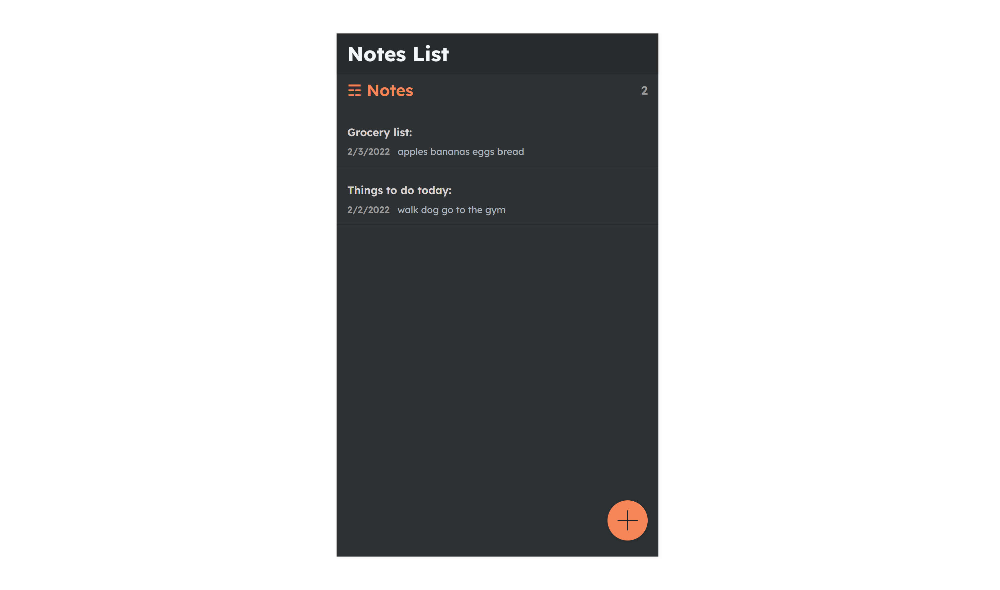

# Notes App

This is a full-stack web app that allows users to create, read, update and delete notes. I built a RESTful API that serves data to a single-page React front-end with stateful components and hooks.
## Tech Stack

**Client:** React, CSS, HTML

**Server:** Django, REST API

## Features

- React front-end
- CRUD functionality
- REST API
- Django models, serializers

## Screenshots

